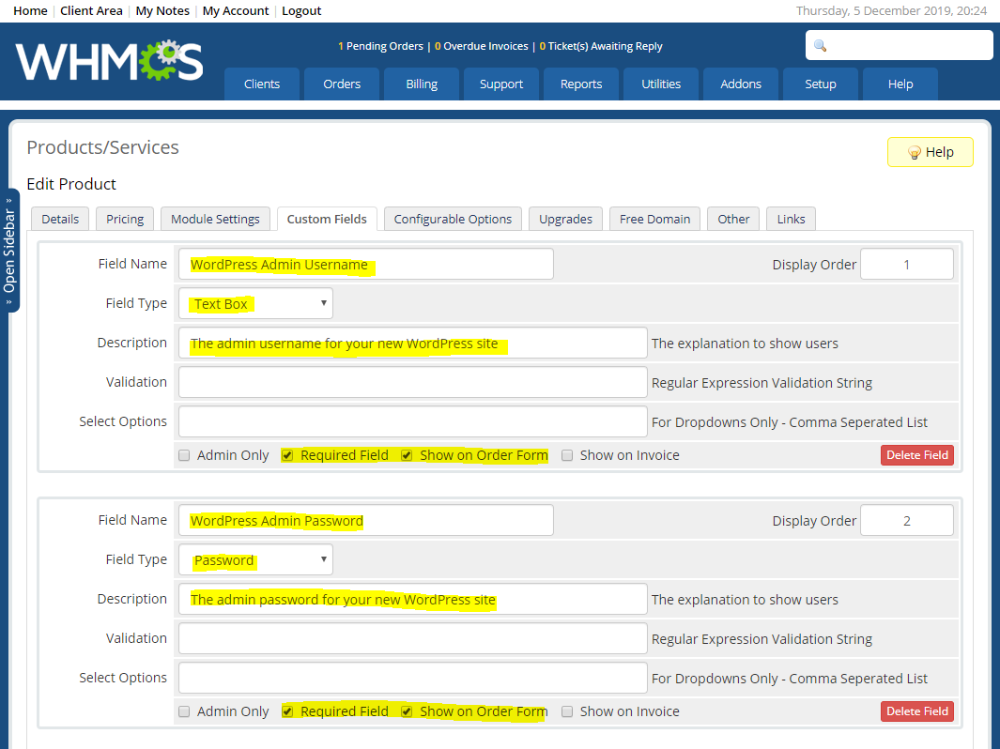

# Themely WHMCS Hook

#### Integrate Themely cPanel plugin with WHMCS and automatically install WordPress on new account creation.

## Installation Instructions

Hooks live inside files located within the `/WHMCS_ROOT/includes/hooks/` directory. To integrate Themely cPanel plugin with WHMCS follow the instructions below.

**Step 1**

Download the `themely.php` file and upload/place it to your hooks directory.

**Step 2**

Log into your WHMCS Admin Dashboard and navigate to `Setup > Products & Services > Products & Services`.

**Step 3**

Click the edit icon for the product you wish to configure. Then, click on `Custom Fields`.

**Step 4**
 
Create 2 custom fields for the WordPress Admin Username and Password. Field names **must be exactly** as you see highlighted below (upper and lowercase characters do matter). Display order is of course at your discretion.

`WordPress Admin Username`

`WordPress Admin Password`

Select *Required Field* & *Show on Order Form* for both.

## Configuration Instructions

You can select which WordPress theme will be installed with WordPress by editing line 90 and 91 of the `themely.php` file.

Configuration options are found on line 86-89.

## Get Help/Support

Hi! My name is Hans Desjarlais and I'm the founder & creator of Themely. Whether you're a hosting company or a theme developer, I'm your primary point of contact. If it's to get assistance with my plugin/service or to suggest new features; I'm here to listen.

**Here's how you can reach me:**

Submit support ticket: https://github.com/ismaelyws/themely-whmcs-hook/issues (click on the green **New Issue** button)

Email: ismaelyws [at] gmail [dot] com

Twitter Direct Message: https://twitter.com/messages/compose?recipient_id=ismaelyws

Phone: +1 (514) 883-0132 (please only use this in case of emergency)

Time Zone: Eastern Standard Time (GMT -4)